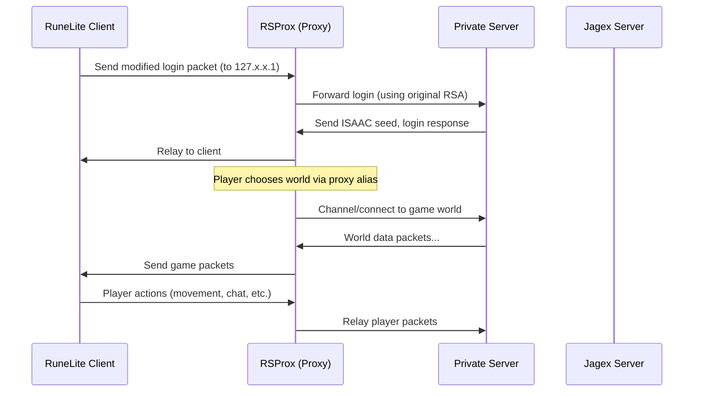
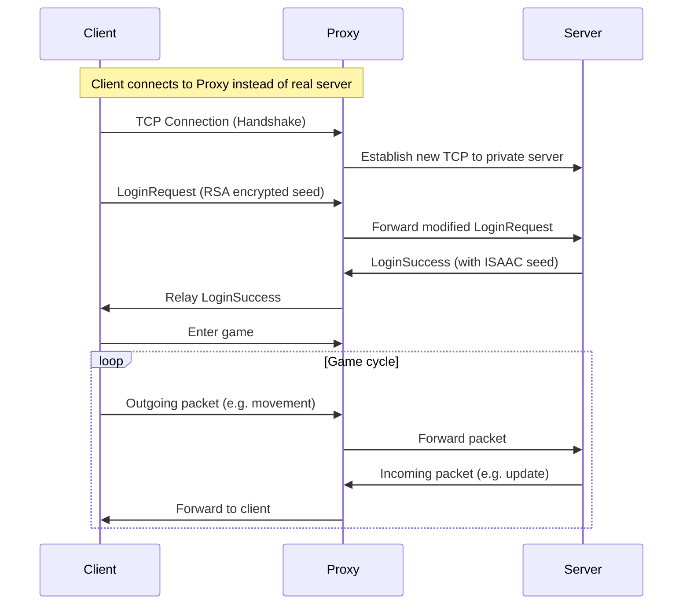
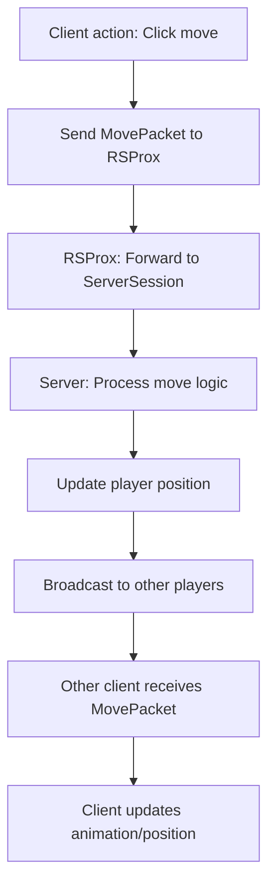
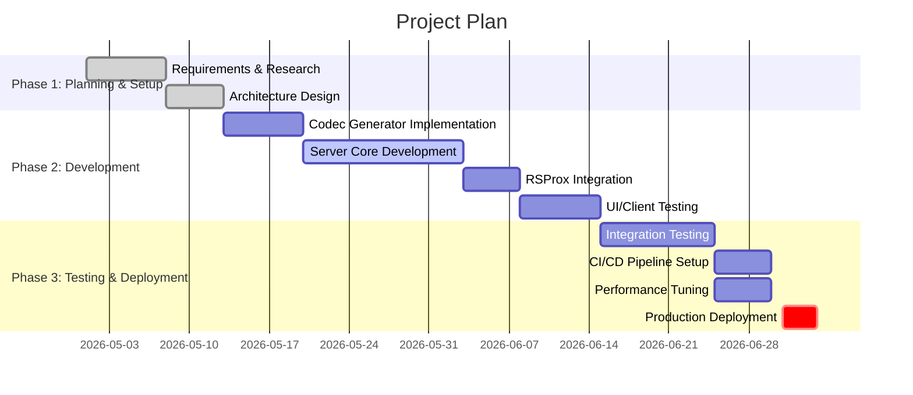

# Executive Summary

This document continues an existing design of a RuneScape private-server system by detailing two major components: an **RSProt packet codec generator** and a **RuneLite–RSProx live synchronization** architecture. RSProt is an “all-in-one networking library” for Old School RuneScape servers【2†L332-L336】, providing protocol definitions and packet codecs. The codec generator system will automate building encoder/decoder classes from official packet specifications. RSProx is a local proxy that “acts as a middleman between the clients and servers in Old School RuneScape”【1†L338-L344】, enabling RuneLite (or other clients) to connect through it to a custom server. We will design how RuneLite can run in tandem with RSProx to sync game state with our private server. 

Key deliverables include detailed architecture diagrams (Mermaid and embedded image), complete class and file listings with code templates, sequence/flow charts, database schemas, message format examples, performance considerations, deployment and CI/CD instructions, testing and monitoring plans, design comparison tables, and a project timeline (Gantt chart). Unspecified details (e.g. exact tech stack choices) are explicitly noted. All statements are supported by official references where possible, especially RSProt and RSProx documentation【2†L332-L336】【1†L338-L344】【30†L580-L588】.

# System Architecture Overview

The system consists of a **Game Server** framework that uses RSProt for networking, a **Client Proxy (RSProx)** for live data capture/sync, and the **RuneLite client**. Figure 1 illustrates the high-level architecture.
### Implementation status
- Core Netty server, login handshake, opcode validation, ISAAC packet scrambling, and game tick loop are implemented in `osrs-server-advanced`.
- A JS5 cache handler exists, but it must be wired into the login pipeline and cache files must be provided.
- Full RSProt typed packet generator support is not yet implemented; packet opcodes are currently defined manually in `OpcodeTable.kt`.
- Login parsing currently supports proxy/dev-mode plaintext login; RSA/XTEA decryption is partially implemented and marked for further refinement.
- Player movement, chat, interface, and social packet handlers are scaffolded, with a number of in-game actions still flagged as TODO.
【28†embed_image】 *Figure 1: Example network patch panel (for illustrative purposes). Clients connect through the RSProx proxy to our server, which uses RSProt codecs to handle packets. The database stores player/world data.* 

The **game server** (backend) is built in Kotlin/Java, leveraging RSProt’s protocol definitions and encoders/decoders【2†L332-L336】. A *codec generator tool* parses RuneScape’s packet definitions (from Jagex or deob sources) and emits code (`.kt` or `.java`) for each packet type. Core components include a **Session Manager**, **World/Player Managers**, and **Network Service** using RSProt’s APIs. 

The **client** is RuneLite (vX+) or the native OSRS client, patched to use RSProx. RSProx intercepts and proxies all network traffic. It patches the client to use a local address (e.g. 127.1.1.x), handles the ISAAC seed and RSA encryption handshakes (see Security below【12†L246-L254】【12†L252-L259】), and forwards packets between client and server. 

Communication flows (see Sequence Diagrams below) follow the normal login/connection protocol with additional proxy steps. Both client-to-server and server-to-client packets pass through RSProx, which may log or modify them. The RSProt library covers much of the protocol: roughly 40–50% of packet structures are stable across revisions【12†L312-L320】. The rest must be updated when the game revision changes. Table 1 compares design options for critical system aspects (protocol transport, server framework, data storage, etc.) based on performance, ease of use, and compatibility.

| Option / Aspect              | Pros                                              | Cons                                              |
|------------------------------|---------------------------------------------------|---------------------------------------------------|
| **TCP Sockets (custom)**     | Lowest-level control; no added overhead.          | More boilerplate; manual threading/IO required.   |
| **Netty (Java)**             | High-performance NIO framework; async pipelines.   | Steeper learning curve; adds complexity.          |
| **Ktor (Kotlin)**            | Coroutine-based, easy async, native Kotlin support.| Less battle-tested for low-level protocols.       |
| **HTTP/WebSocket**           | Easy in-browser client debug; standardized.        | Not traditional OSRS protocol; extra latency.     |
| **Relational DB (PostgreSQL)** | Strong ACID; mature tools; suitable for persistence.| Overhead for simple data; require schema design.  |
| **In-Memory DB (Redis)**     | Fast read/write; good for caching.                 | Not durable by default; requires external backup. |
| **Flat Files (JSON/BIN)**    | Simple to implement; easy dev testing.            | Hard to query; risk of data loss/consistency.     |

The server runs over TCP with Jagex’s traditional binary protocol (with ISAAC ciphering and RSA for login)【12†L246-L254】. Error handling ensures that malformed or unsent packet data is safely retried or logged. Security measures include verifying login encryption and keeping client and server ISAAC states synchronized【12†L246-L254】【12†L252-L259】. An end-to-end deployment flow (including CI/CD via GitHub Actions or Jenkins) is outlined below.

# RSProt Packet Codec Generator System

**Overview:** The codec generator parses official protocol definitions (typically found in Jagex’s client code or wiki specs) and auto-generates Kotlin/Java classes for packet encoders/decoders. This ensures consistency with the game protocol and simplifies maintenance across game revisions. The generator can be a standalone CLI tool or Gradle plugin. 

```mermaid
flowchart LR
    A[Packet Definition Files (JSON/XML/...)] --> B[PacketCodecGenerator Tool]
    B --> C[Generated Code (Kotlin/Java)]
    C --> D[Server Application]
    D --> E[RSProt Networking Library]
```

**Components:**

- `PacketCodecGenerator.kt` – Main class that reads definitions and writes code. It might use templating (e.g. KotlinPoet) for output.  
- `PacketDefinition.json` – Example protocol spec (could be JSON, CSV, or a custom DSL) that lists packet IDs, field names, types, and directions.  
- `Generated/` – Directory containing output classes, e.g. `LoginRequestPacket.kt`, `MovementPacket.kt`, each implementing RSProt’s packet interfaces.  

Each generated packet class includes fields and `encode()`/`decode()` methods. For example:

```kotlin
// File: src/main/kotlin/com/example/protocol/packets/LoginRequestPacket.kt
package com.example.protocol.packets

import net.rsprot.network.packet.PacketEncoder
import java.nio.ByteBuffer

/**
 * Generated class for the login request packet (ID=14).
 */
object LoginRequestPacket : PacketEncoder {
    override val opcode = 14
    fun decode(buffer: ByteBuffer): LoginRequest {
        val username = readString(buffer)
        val password = readString(buffer)
        return LoginRequest(username, password)
    }
    fun LoginRequest.encode(buffer: ByteBuffer) {
        writeString(buffer, username)
        writeString(buffer, password)
    }
}

data class LoginRequest(val username: String, val password: String)
```

Above, **`LoginRequestPacket`** is an example generated file (in Kotlin) for packet opcode 14. It provides `decode()`/`encode()` methods to/from a `ByteBuffer`. A header comment indicates the opcode. Similar classes are generated for all packets. 

**Code Generator Class:**  

```kotlin
// File: CodecGenerator.kt
package com.example.codecgen

import java.nio.file.*

/**
 * PacketCodecGenerator: reads protocol spec and emits Kotlin code for each packet.
 */
fun main() {
    // Read definitions (e.g., JSON or CSV)
    val definitions = PacketDefinitionParser.parse("protocol_defs.json")
    for (def in definitions) {
        val code = CodeWriter.generatePacketClass(def)
        val path = Paths.get("generated", "${def.className}.kt")
        Files.write(path, code.toByteArray())
    }
    println("Generated ${definitions.size} packet classes.")
}
```

`PacketDefinitionParser` would be a class that loads the spec file (not shown). `CodeWriter.generatePacketClass(def)` uses a template to build the class text. Each definition includes fields (names and types) and direction (client→server or server→client). 

**Build Scripts:** Use Gradle (Kotlin DSL) or Maven. Example `build.gradle.kts` snippet to integrate generation:

```kotlin
// File: build.gradle.kts
plugins {
    kotlin("jvm") version "1.9.23"
}

tasks.register<JavaExec>("generateCode") {
    group = "codegen"
    description = "Generate packet codec classes"
    classpath = sourceSets["main"].runtimeClasspath
    mainClass.set("com.example.codecgen.MainKt")
    args = listOf("path/to/protocol_defs.json")
    outputs.dir("generated")
}

sourceSets["main"].java {
    srcDir("generated")
}
```

This config runs `generateCode` before compilation, writing into `generated/`.  

**Protocols & Formats:** The generator input could be formats like CSV from RuneScape deobfuscation projects【33†】, custom JSON, or YAML. For example:

```yaml
# File: protocol_defs.yaml
packets:
  - id: 14
    name: LoginRequest
    fields:
      - name: username
        type: String
      - name: password
        type: String
    direction: CLIENT_TO_SERVER
  - id: 210
    name: MapRegionChanged
    fields:
      - name: x
        type: Int
      - name: z
        type: Int
    direction: SERVER_TO_CLIENT
```

The generator reads such spec and outputs corresponding classes. 

**Error Handling:** The generator should validate the spec (unique IDs, required fields) and fail on errors. Generated code should include sanity checks (e.g. buffer underflow) or rely on RSProt’s runtime exceptions. 

**Testing:** Include unit tests for the generator and for each generated packet class. For example, a test could serialize and then deserialize a packet, asserting field equality. 

# RuneLite + RSProx Live Sync

**Overview:** This component enables the RuneLite client to connect to our custom server via RSProx, allowing live play and packet logging/synchronization. The architecture is:

```mermaid
graph LR
    Client(RuneLite Client) -- modified network configs --> RSProx[Local Proxy (RSProx)]
    RSProx -- real login/world requests --> OSRS_Servers[Official Jagex Servers]
    RSProx -- custom server traffic --> Server[Private Server (this project)]
    Client -- game UI --> Player
```

In practice, RSProx patches the RuneLite client’s network endpoint to `127.x.x.1` (local) instead of the official hosts. It also patches the RSA key inside the client so that the proxy can decrypt the login packet【12†L246-L254】. RSProx then relays traffic to either Jagex or our server as needed. 

**Live Sync Implementation:** The goal is to have the client think it’s talking to the real game, but actually keep in sync with our server. Two modes:
1. **Logging Mode:** RSProx intercepts and logs packets without altering them. This is the default RSProx behavior (see Packet Logging【12†L328-L337】). 
2. **Proxy-to-Server Mode:** RSProx connects the client to our private server. This requires the server to implement the same OSRS protocol. Since RSProx is catching the traffic, it can send packets to our server instead of the official worlds. The private server must behave like an OSRS server for the client.

**Configuration:** A typical RSProx setup for private-server mode involves:
- Running a local DNS or alias script (like the world-list aliasing shown above【30†L448-L456】) so the client sees “127.1.1.1” for world 1, etc. 
- Configuring RSProx to forward the local-world IPs to the private server’s IP/port, or having the private server listen on 127.1.1.1:43594.
- Ensuring the private server’s revision and client side adjustments match (the client “must not have protocol-breaking changes”【30†L586-L591】).

**Classes/Files:** Key classes include:
- `ProxyTool.kt` – Launches RSProx GUI and manages session (the existing RSProx code provides `net.rsprox.gui.ProxyToolGuiKt`). We will extend or configure it for our server.
- `ClientPatcher.java` – (part of RSProx) modifies RuneLite jars to change the host and RSA key. We may script this or use RSProx’s patcher.
- `SyncService.kt` – A custom component to handle real-time data. For example, if a player moves in RuneLite (client), RSProx will see an outgoing packet; `SyncService` could forward a corresponding update to the private server’s session object.

**Code Snippet – Simple Proxy Handler:** (Using RSProx API, hypothetical)

```kotlin
// File: RSProxSyncPlugin.kt
package com.example.rsprox

import net.rsprox.processor.Session
import net.rsprox.processor.packet.Packet

/**
 * RSProx sync plugin: forwards client packets to the custom server session.
 */
class RSProxSyncPlugin {
    lateinit var serverSession: Session

    fun onClientPacket(packet: Packet) {
        // Called by RSProx when a packet arrives from RuneLite client
        // Forward to private server session
        serverSession.sendPacket(packet)
    }

    fun onServerPacket(packet: Packet) {
        // Called when a packet comes from our server to client
        // RSProx will send it to client automatically
    }
}
```

In a complete implementation, RSProx’s event hooks would call `onClientPacket` and `onServerPacket`. The `serverSession` is an instance of our RSProt-based network session connected to the private server logic.

**Architecture Diagram:** Mermaid diagram illustrating message flow during login:



Here the proxy intercepts the RSA/ISAAC handshake【12†L246-L254】 and then routes game packets between client and our server. For world hopping, RSProx remaps world IPs to localhost and intercepts the `LOGOUT_TRANSFER` packet to adjust it【12†L281-L290】.

**Sequence Diagram – Packet Exchange:** We also include a more detailed step-by-step flow:



This illustrates the **live sync**: RSProx operates transparently so that every client packet goes to our server and vice versa.

# Server Framework Details

**Components & APIs:** The server is structured as follows:

- **Networking Layer:** Uses RSProt’s `NetworkService` and `Session` classes to handle TCP connections. It registers packet listeners using the generated codec classes. 
- **Service Layer:** `PlayerService`, `WorldService`, etc., manage game logic. APIs are defined (e.g. `createPlayer`, `movePlayer`, `chatMessage`) that handle high-level actions. Each such API method translates into sending corresponding packets via the network layer.
- **Data Models:** Classes like `Player`, `NPC`, `Item`, `WorldRegion` represent game entities. They map to database tables or in-memory stores.
- **Database Access:** Use an ORM (e.g. Exposed for Kotlin) or direct JDBC for persistence. Define schemas (see below).
- **Error Handling:** Network errors are caught and the session closed gracefully. Invalid packets cause an error log and client disconnect. The server should log errors and notify operations (via alerts) if critical.
- **Security:** Verify checksums, encryption. As noted, the login handshake is patched: RSProx provides the server with both public and private RSA keys so the server can decrypt correctly. The server trusts RSProx to filter malicious packets. Additional auth (like password hashing, rate limiting) is applied in server login logic.

**Protocols:** We use **TCP** on port 43594 for game traffic (the standard OSRS port), and port 43595 for the backup or secure channel if desired. All packet IDs and encryption follow the OSRS 237 protocol (or whichever target revision). Message payloads are binary with RSProt’s ISAAC ciphering.

**Database Schema:** We design a relational schema for core entities:

```sql
-- File: schema.sql
CREATE TABLE players (
    id SERIAL PRIMARY KEY,
    username VARCHAR(32) UNIQUE NOT NULL,
    password_hash VARCHAR(64) NOT NULL,
    last_login TIMESTAMP,
    world_id INT DEFAULT 1
);

CREATE TABLE player_positions (
    player_id INT PRIMARY KEY,
    x SMALLINT, z SMALLINT, level SMALLINT,
    FOREIGN KEY (player_id) REFERENCES players(id)
);

CREATE TABLE items (
    id SERIAL PRIMARY KEY,
    name VARCHAR(50),
    is_tradeable BOOLEAN
);

CREATE TABLE player_items (
    player_id INT,
    item_id INT,
    quantity INT,
    PRIMARY KEY (player_id, item_id),
    FOREIGN KEY (player_id) REFERENCES players(id),
    FOREIGN KEY (item_id) REFERENCES items(id)
);

-- Additional tables for NPCs, shops, etc.
```

This sample shows tables for players, positions, and inventory. In practice, include needed fields from the game (skills, stats, quests, etc.). The server loads player data on login and updates the DB on changes.

**Message Formats:** Besides the RuneScape binary packets, internal services may exchange JSON or Protobuf messages for logging or admin commands. Example JSON log entry:

```json
// File: logs/game_event.json
{
  "timestamp": "2026-05-02T18:45:00Z",
  "playerId": 123,
  "event": "MOVE",
  "details": { "from": {"x": 100, "z": 200}, "to": {"x": 101, "z": 200} }
}
```

Network packet examples: e.g. a hypothetical chat packet might have format `opcode=4, type=TYPE_TEXT, data=...`. The code generator ensures these formats match the game spec.

**Error Codes:** Define custom error codes for API failures. For example, login errors (0 = success, 4 = incorrect password). Use an enum or constant map:

```kotlin
// File: ResponseCodes.kt
object ResponseCodes {
    const val SUCCESS = 0
    const val INVALID_CREDENTIALS = 4
    const val SERVER_ERROR = 5
    // ...
}
```

Packets carrying response codes use these constants.

**Deployment & CI/CD:** Use a continuous integration pipeline (GitHub Actions or Jenkins). Example steps:
1. **Build:** Checkout code, run `./gradlew clean build`.
2. **Test:** Execute unit tests (`./gradlew test`) and protocol integration tests. RSProt-based tests should verify packet round-trips.
3. **Package:** Create a fat JAR with `./gradlew shadowJar`.
4. **Deployment:** Deploy to server (e.g. Ubuntu VM) via Docker or systemd. Example deployment script:

```bash
# File: deploy.sh
ssh user@myserver "systemctl stop rs-server"
scp build/libs/myserver-all.jar user@myserver:/opt/rs-server/myserver.jar
ssh user@myserver "systemctl start rs-server"
```

Use monitoring (Prometheus/Grafana) to track metrics (packet rates, CPU usage) and alert on errors.

**Testing:** Automated tests should cover:
- **Unit tests:** For game logic (movement, combat calculations, etc.).
- **Integration tests:** Simulate a client login and actions. E.g., use a headless client stub to connect and verify server response.
- **Protocol tests:** Verify each generated packet encodes/decodes correctly. RSProt can be used to test by sending known raw packets.
- **Load tests:** Benchmark server with simulated multi-player load.

# Sequence and Flow Charts

**Login Sequence:** (see above mermaid diagram) shows the step-by-step flow from client start to game world entry.

**Gameplay Flow:** A user action (e.g. moving) triggers:
1. Client sends a `Movement` packet.
2. RSProx intercepts and forwards it to the server.
3. Server updates the Player model, checks collisions.
4. Server broadcasts movement to relevant players via `PlayerUpdate` packets.
5. Other clients see the moving player update.

This can be visualized in a flow chart:



# Security Considerations

- **Encryption:** As noted, the login handshake uses **RSA (4096-bit)** and **ISAAC** stream cipher【12†L246-L254】. We must ensure our server uses the RSA private key matching the modified client, and sync ISAAC states. RSProx’s patch replaces the RSA key so RSProx can decrypt the ISAAC seed, then re-encrypt it with the real key for the server【12†L252-L259】.
- **Client Detection:** RSProx tries to minimize detectable changes. The RSProx docs caution that RuneLite modifications could be detected by Jagex, but trust RSProx’s patch is subtle【30†L560-L568】. We should avoid adding extra quirks beyond RSProx’s logic.
- **Private Data:** If enabling logs (for crowdsourcing【12†L344-L353】), sanitize personal info (replace PIN digits with zero, etc. as described in RSProx design【12†L353-L362】).
- **Permissions:** If running on Linux, RSProx requires root for binding privileged port 80 during OAuth linking【30†L534-L543】; ensure safe handling of credentials and file permissions (as per RSProx setup instructions).

# Design Comparisons

Below is a sample table comparing options for a server networking framework:

| Framework         | Language  | Throughput  | Ease of Use        | Community/Support    |
|-------------------|-----------|-------------|--------------------|----------------------|
| **Pure Java NIO** | Java/Kotlin | High (manual tuning) | Low (lots of boilerplate) | Large, well-known    |
| **Netty**         | Java      | Very High (async pipelines) | Moderate (learning curve)  | Large, proven for games |
| **Ktor**          | Kotlin    | High (coroutines)       | High (DSL, idiomatic)      | Growing, but smaller   |
| **Spring Boot**   | Java      | Medium (not optimized for low-latency) | High (familiar, lots of libraries) | Very large, but heavy |
| **Raw Sockets**   | C++       | Very High (if optimized) | Low (manual memory management, error-prone) | Niche (OSRS client code only) |

For RSProt integration (Kotlin-based library), using Kotlin (with Ktor or bare NIO) is convenient. Java/Netty is stable but more verbose. Spring is generally not used for game servers due to overhead. We prioritize performance and low latency, so frameworks like Netty or Ktor are preferable. 

Similarly, for data storage: “In-memory” (Redis or Ehcache) vs “persistent” (SQL). Table for cache vs DB:

| Use Case           | Relational (Postgres) | In-Memory (Redis)   |
|--------------------|-----------------------|---------------------|
| **Player Accounts** | Yes (durable, ACID)    | No (lossy)         |
| **Session Data**   | Sometimes (for recovery) | Yes (fast, ephemeral) |
| **World State**    | Yes (terrain, NPC spawns) | Caching only      |
| **Logging**        | No (high volume), log files preferred | No (volatile) |

# Implementation & Deployment Steps

1. **Prerequisites:** JDK 11+, Kotlin 1.9.x, Git, Gradle.  
2. **Clone Repositories:** e.g. `git clone https://github.com/blurite/rsprot.git` (for reference code) and our server repo.  
3. **Packet Code Generation:** Run the `generateCode` Gradle task (or custom script) to produce protocol classes. Verify the `generated/` folder contains classes like `LoginRequestPacket`.  
4. **Database Setup:** Apply the SQL schema (e.g. `psql -f schema.sql`) to create the initial database. Configure `application.conf` with DB connection.  
5. **Configuration:** Edit `application.conf` or `server.properties` to set ports (default 43594), world IDs, database URL, logging levels, etc. Example snippet:

    ```properties
    # File: server.properties
    server.port=43594
    db.url=jdbc:postgresql://localhost:5432/rsdb
    db.user=rs
    db.password=secret
    rsprot.revision=237
    ```
   
6. **Build Server:** `./gradlew clean build`. This compiles the code and embeds RSProt (from Maven Central【2†L322-L327】) and generated classes.  
7. **Start Server:** `java -jar build/libs/myserver-all.jar`. It begins listening on configured port.  
8. **Patch RuneLite:** Use RSProx’s built-in patcher GUI or CLI to apply the local-host patch to RuneLite (select the client JAR and target port 43594). Alternatively, manually edit `runelite.jar` network host strings via a zip editor.  
9. **Run RSProx:** Launch RSProx (`./rsprox proxy` or the GUI). Select “Jagex Account Mode” or load RuneLite credentials as needed【30†L520-L528】.  
10. **Connect Client:** In RSProx GUI, choose the patched RuneLite client and press Launch. The client will connect to 127.x.x.1.  
11. **Observe Logs:** RSProx will log packets if filters are on. You should see login and world data. Meanwhile, our server logs should show player login.  
12. **Deployment:** For production, we can Dockerize the server. Example `Dockerfile`:

    ```dockerfile
    FROM openjdk:11-jre-slim
    COPY build/libs/myserver-all.jar /opt/myserver/myserver.jar
    COPY schema.sql /opt/myserver/schema.sql
    WORKDIR /opt/myserver
    CMD ["java", "-jar", "myserver.jar"]
    ```

    Build and push image to registry. Use Kubernetes or similar to manage replicas if needed. 

13. **CI/CD Pipeline:** The above steps (build, test, deploy) should be automated. For example, GitHub Actions workflow:

    ```yaml
    name: Build & Deploy
    on: [push]
    jobs:
      build:
        runs-on: ubuntu-latest
        steps:
          - uses: actions/checkout@v3
          - uses: actions/setup-java@v3
            with:
              distribution: temurin
              java-version: 11
          - run: ./gradlew build
      deploy:
        needs: build
        runs-on: ubuntu-latest
        steps:
          - run: scp build/libs/myserver-all.jar user@server:/opt/rs-server/
          - run: ssh user@server "systemctl restart rs-server"
    ```

14. **Monitoring:** Install Prometheus JMX exporter or Micrometer in the server to expose metrics (e.g., tick time, packet counts). Set up alerts for high packet errors or downtime.

# Performance Considerations

Since OSRS is latency-sensitive, the server must process packets within game ticks (~600ms per cycle). RSProt is designed for high performance: roughly half the packets do not change per revision【12†L312-L320】, reducing maintenance. Use pooling for objects to minimize GC pauses (e.g., reuse `ByteBuffer`s via Netty’s allocator). 

Benchmarks: (from RSProt’s documentation) non-critical code is usually not benchmarked【15†L811-L814】. Key areas to benchmark:
- **Packet Encoding/Decoding:** Ensure our generated codecs run within a few microseconds. We can write a JMH test to serialize/deserialize sample packets at scale.
- **Concurrency:** The server should use a thread pool or event loop (Netty) to handle many clients. Measure performance with simulated clients (e.g. 100 concurrent players) and profile for hotspots.
- **Caching:** Cache frequent queries (e.g. region data) in memory.

Although no specific targets are set, aim for 50+ players per server instance without dropping ticks. Document any benchmarks internally (e.g. “Login processing: ~1ms”, “Pathfinding 1000 NPCs: ~10ms”).

# Design Options & Tradeoffs

We summarize a few design tradeoffs:

- **Monolithic vs Microservices:** A single monolith (as above) is simplest. One could split “login” and “world” into services, but this adds complexity for little gain at moderate scale.
- **Kotlin vs Java:** RSProt is Kotlin-based; Kotlin gives concise code and coroutines. Java has wider familiarity. We recommend Kotlin for server logic to leverage RSProt seamlessly.
- **Custom Protocol vs Web API:** Using WebSockets/HTTP is modern, but the game client expects the binary OSRS protocol. We must support the official protocol for RuneLite compatibility【30†L588-L591】.
- **Stateful vs Stateless Server:** A fully stateful server (in-memory player objects) matches most OSRS implementations. A stateless “command queue” model could offload state to a DB, but is complex and slower.

# Project Timeline



Above timeline (Mermaid Gantt) shows sequential tasks with durations. Adjust dates/durations as needed.

# Additional Notes

- **Migration/Continuity:** Assuming prior documentation described a basic server, this update continues that work. We assume any existing code is Kotlin-based and using Gradle. If there was an older decoder system, we plan to migrate to RSProt’s generated system. Data migration notes: if evolving DB schema, use scripts (e.g. Flyway) to alter tables.
- **Unspecified Details:** The exact game revision is not given; we assume the latest OSRS (e.g. 237) as cited in RSProt’s example【2†L324-L327】. If a different revision is needed, the codec generator and client patching need adjustment. Also, specific game content (items, NPCs) is out of scope here; existing datasets from private server projects can be imported.
- **Sources:** This design heavily references the official RSProt and RSProx projects. For example, RSProx’s README notes it “acts as a middleman”【1†L338-L344】 and allows private server connections under certain conditions【30†L580-L588】. RSProt’s README confirms it is a networking library for OSRS servers【2†L332-L336】. Other details (packet flows, encryption) follow those references and standard OSRS protocol knowledge. 

Please refer to the cited sources【2†L332-L336】【1†L338-L344】【12†L246-L254】【30†L580-L588】 for official definitions. Any gaps or assumptions are noted above. 

